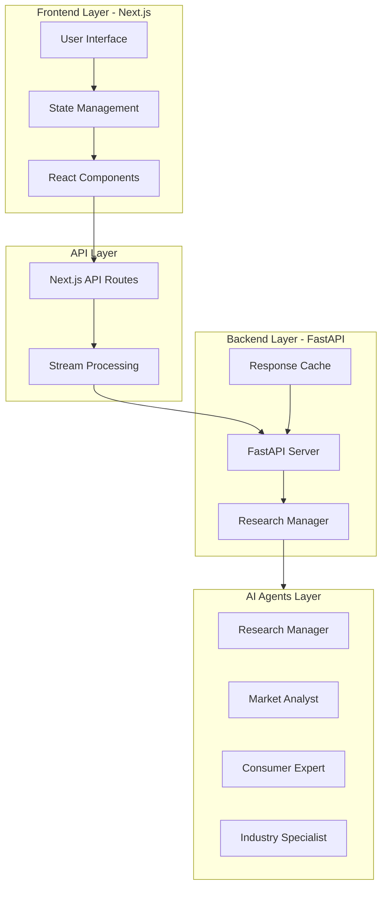
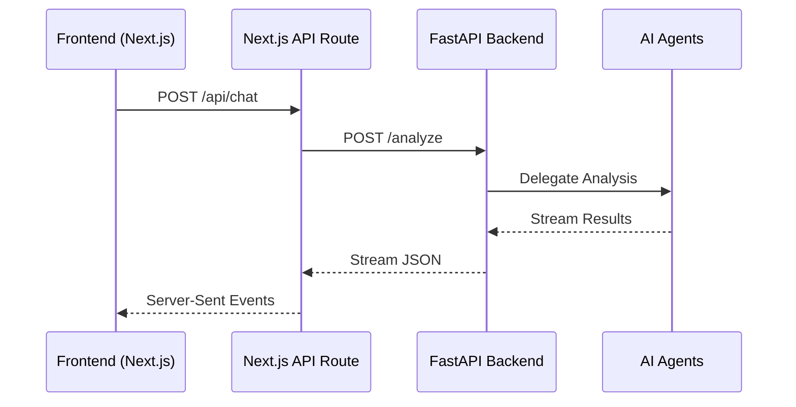

# AI-Powered Market Research System

## Project Overview
The AI-Powered Market Research System is an advanced analytics platform that leverages artificial intelligence to provide comprehensive market research and analysis. The system employs multiple specialized AI agents to analyze markets, consumer behavior, industry trends, and competitive landscapes.

## Architecture

### High-Level Architecture


### Data Flow Architecture


## Tech Stack

### Frontend
- **Framework**: Next.js 14
- **Language**: TypeScript
- **UI Components**: 
  - Tailwind CSS
  - Shadcn/ui
  - React Markdown
  - Lucide Icons
- **State Management**: React Hooks
- **Data Visualization**: 
  - Interactive Charts
  - Dynamic Tables

### Backend
- **Framework**: FastAPI
- **Language**: Python 3.11+
- **AI Integration**: 
  - CrewAI
  - LangChain
- **Data Processing**: 
  - Pandas
  - NumPy
- **Caching**: Custom caching system

### API Layer
- **Protocol**: Server-Sent Events (SSE)
- **Data Format**: JSON Streaming
- **Error Handling**: Structured Error Objects
- **Timeout**: 10-minute maximum

### Development & Deployment
- **Version Control**: Git
- **Package Management**: 
  - npm (Frontend)
  - pip (Backend)
- **Development Environment**: 
  - Node.js
  - Python virtual environment

## Features

### 1. Interactive Research Interface
- Clean, modern UI design
- Real-time analysis updates
- Voice search capability
- Context-aware research parameters

### 2. Multi-Agent Analysis System
- **Research Manager**:
  - Strategy overview
  - Research coordination
  - High-level insights
- **Market Analyst**:
  - Market trends analysis
  - Competition assessment
  - Growth opportunities
- **Consumer Expert**:
  - Consumer behavior analysis
  - Market segmentation
  - Demographic insights
- **Industry Specialist**:
  - Technical analysis
  - Industry-specific metrics
  - Regulatory considerations

### 3. Real-Time Results
- Streaming updates
- Progressive loading
- Interactive data visualization
- Dynamic content rendering

### 4. Data Visualization
- Interactive charts
- Dynamic tables
- Custom visualization components
- Export capabilities

### 5. Export & Sharing
- PDF export functionality
- Markdown report generation
- Clipboard copying
- Saved searches

### 6. Error Handling & Reliability
- Graceful error recovery
- Timeout management
- Request retry mechanism
- Structured error reporting

## Purpose & Benefits

### Business Intelligence
- Rapid market analysis
- Competitive insights
- Consumer behavior understanding
- Industry trend identification

### Decision Support
- Data-driven decision making
- Strategic planning assistance
- Risk assessment
- Opportunity identification

### Efficiency
- Automated research process
- Real-time analysis
- Comprehensive reporting
- Time and resource savings

### Accessibility
- User-friendly interface
- Voice search capability
- Mobile responsiveness
- Exportable reports

## Future Enhancements
1. Advanced AI model integration
2. Additional visualization options
3. Enhanced export formats
4. Collaborative features
5. Custom agent creation
6. Integration with external data sources

## Getting Started

### Prerequisites
- Node.js 18+
- Python 3.11+
- Git

### Installation
1. Clone the repository
2. Install frontend dependencies:
   ```bash
   npm install
   ```
3. Install backend dependencies:
   ```bash
   pip install -r requirements.txt
   ```
4. Set up environment variables:
   ```
   Copy .env.example to .env
   Configure API keys and settings
   ```
5. Start development servers:
   ```bash
   # Frontend
   npm run dev

   # Backend
   uvicorn src.api.main:app --reload
   ```

## Security Considerations
- API key management
- Rate limiting
- Data encryption
- Access control
- Error message sanitization

## Performance Optimization
- Response caching
- Stream processing
- Lazy loading
- Resource optimization
- Query optimization

## Contributing
Contributions are welcome! Please read our contributing guidelines and code of conduct before submitting pull requests.

## License
This project is licensed under the MIT License - see the LICENSE file for details. 